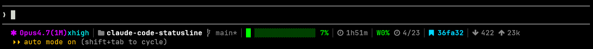

# Claude Code Status Line



A polished, colorful status bar for [Claude Code](https://claude.com/claude-code) that shows your model, directory, git status, context usage, session limits, and token counts — all on one line.

## Features

- **Model and effort level**, colored by family (Opus magenta, Sonnet cyan, Haiku amber), prefixed with an Anthropic-style asterisk mark
- **Directory and git branch** with a dirty indicator, each tagged with a Nerd Font icon
- **16-block context bar** with partial-block fine fill and smart coloring (green ≤50%, yellow ≤75%, red >75%)
- **Session reset countdown** — time until the next 5-hour window flips
- **Weekly usage percentage** — same color rules as the context bar
- **Session label** — your custom name (via `/rename` or `--name`), or the first 6 chars of the `session_id` as a fallback
- **Input and output token counts** for the session
- **Graceful narrow-terminal degradation** — drops segments right-to-left as the window shrinks
- **Zero dependencies** — pure Python stdlib, one file

## Install

Clone the repo and run the installer:

```bash
git clone https://github.com/dissidentcode/claude-code-statusline.git
cd claude-code-statusline
python install.py
```

That's it. Restart Claude Code, or type `/hooks` inside a session to reload the config.

The installer:
1. Copies `statusline.py` to `~/.claude/statusline.py`
2. Backs up `~/.claude/settings.json` to `settings.json.bak`
3. Adds a `statusLine` entry pointing at the installed script

Re-running the installer is safe — it's idempotent.

## Requirements

- **Claude Code** — [install instructions](https://claude.com/claude-code)
- **Python 3.8+** on your `PATH`
- **git** (optional) — only needed if you want the branch segment to show anything
- A **[Nerd Font](https://www.nerdfonts.com/)**-patched terminal font. The status bar uses Nerd Font glyphs for the model, folder, branch, clock, session, and token arrows — without one, those positions render as tofu (□). Any Nerd Font works: **JetBrainsMono Nerd Font**, **FiraCode Nerd Font**, **CaskaydiaCove Nerd Font**, etc. Windows Terminal, iTerm2, Alacritty, Kitty, and Wezterm all render correctly once the font is set.

## Uninstall

```bash
python uninstall.py
```

Removes the `statusLine` key from `settings.json`, deletes `~/.claude/statusline.py`, and clears the git cache. Your `settings.json.bak` is left in place so you can restore anything else if you need to.

## Manual install

If the install script doesn't work for you, here are the two steps it does:

1. Copy `statusline.py` to `~/.claude/statusline.py` (or `%USERPROFILE%\.claude\statusline.py` on Windows)
2. Open `~/.claude/settings.json` in a text editor and merge this top-level key (don't replace the file — add it alongside what's already there):

   ```json
   "statusLine": {
     "type": "command",
     "command": "python3 \"/Users/you/.claude/statusline.py\"",
     "padding": 0
   }
   ```

   Replace `python3` with `python` if that's what works on your system, and replace the path with your actual home directory.

3. Restart Claude Code, or type `/hooks` in a session to reload.

## Customization

`statusline.py` is plain Python — open it and edit. The parts most people change:

- **Colors**: the `c256(...)` constants near the top. [256-color chart](https://www.ditig.com/256-colors-cheat-sheet)
- **Bar width**: change `BAR_WIDTH` (default 16)
- **Bar glyphs**: swap `FULL`, `EMPTY`, `PARTIALS` for any other block characters
- **Icons**: the `ICON_*` constants near the top hold each Nerd Font codepoint — `ICON_MODEL` (asterisk), `ICON_FOLDER`, `ICON_BRANCH`, `ICON_CLOCK`, `ICON_BOOKMARK`, `ICON_ARROW_DOWN`, `ICON_ARROW_UP`. Browse the [Nerd Font cheat sheet](https://www.nerdfonts.com/cheat-sheet) and drop in a new `\uXXXX` escape
- **Separator**: `▕` is still a plain Unicode block glyph — swap for anything your font likes
- **Segments**: comment out any `parts.append(...)` line inside `main()` to hide a segment
- **Thresholds**: edit `pct_color()` to change where green → yellow → red

After editing, restart Claude Code or type `/hooks` to reload.

## Troubleshooting

**Nothing shows in the status line**
Type `/hooks` in Claude Code to reload the config, or restart the app. Sessions that were open before the install don't automatically pick up the new `statusLine` entry.

**Squares or "tofu" instead of glyphs**
Your terminal font isn't a Nerd Font. The icons live in the Unicode Private Use Area, so only Nerd Font-patched builds have them. Grab any build from [nerdfonts.com](https://www.nerdfonts.com/font-downloads) — the "Mono" variants (e.g. JetBrainsMono Nerd Font Mono) work best in terminals. Set it as your terminal's font and the glyphs will render.

**The model color looks wrong / one color for everything**
Your terminal might not support 256-color mode. Most modern ones do. If yours doesn't, set `NO_COLOR=1` in your environment to fall back to plain text.

**`python` isn't found on Windows**
If you installed Python from the Microsoft Store, `python` may be a stub that doesn't work. Install Python from [python.org](https://www.python.org/downloads/) with "Add Python to PATH" checked, or use [scoop](https://scoop.sh): `scoop install python`.

**The effort level shown is wrong after I ran `/effort`**
The effort shown is the saved value in `settings.json`. A session-only `/effort` override isn't in the data Claude Code passes to the status line, so the bar keeps showing the saved value until you restart.

**Git branch shows "git…"**
Your repo is big enough that the 1.5-second git timeout expired. Open `statusline.py` and bump `GIT_TIMEOUT`.

## How it works

Claude Code spawns the `statusLine` command after every event in a session (new message, tool call, stop) and pipes a JSON blob to it on stdin. The script parses the blob, gathers git info locally, and writes one colored line to stdout. Claude Code renders that line in the session footer.

The full payload schema and documentation: https://code.claude.com/docs/en/statusline

## License

MIT — see [LICENSE](LICENSE).
